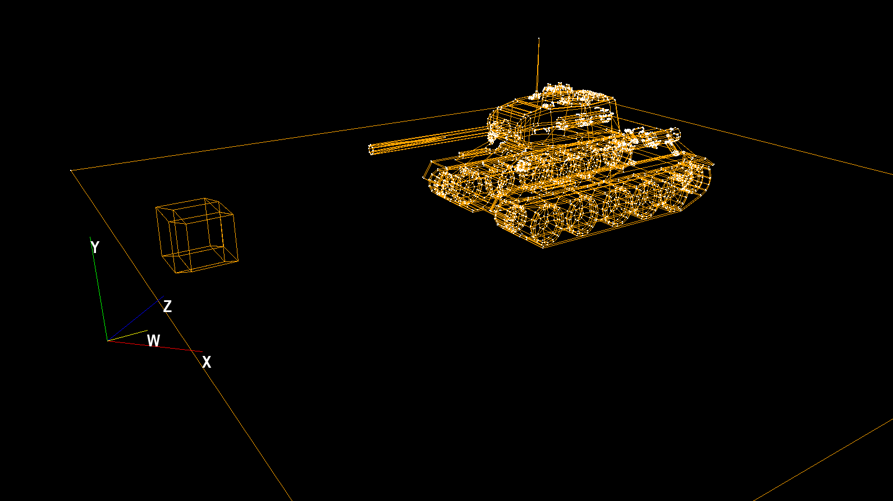

# obj4dviewer
Python 4D Engine (Object Renderer) with Pygame, Numpy, Numba




## About The Project
This is a viewer for 4D objects. It projects a 4D object onto a 3D plane, and then from a 3D plane to a 2D screen. It is backwards compatible with regular 3D obj files. A 4d obj file specified with the .obj4 extension.

# Getting Started
## Installation
Clone the repo with
```
git clone https://github.com/tantock/obj4drender.git
```
In the project root directory, run
```
pip install -r requirements.txt
```
Then run
```
pip install -e .
```
to install the obj4drender library.

## Contributing

Pull requests are welcome. For major changes, please open an issue first
to discuss what you would like to change.

Please make sure to update tests as appropriate.

## License

[MIT](https://choosealicense.com/licenses/mit/)

## Acknowledgments

- [StanislavPetrovV](https://github.com/StanislavPetrovV) 
    - This project would not have been possible without the base code provided by [StanislavPetrovV](https://github.com/StanislavPetrovV). Many thanks for their hard work and their accompanying video at [YT video](https://www.youtube.com/watch?v=M_Hx0g5vFko)